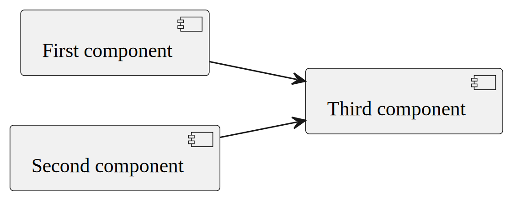

.SrcDpi (300) defines dimensions
[.srcdpi-300.fitrect-17000-25000]

.Fitrect width (90mm) defines dimensions
[.srcdpi-300.fitrect-8000-25000]

.Fitrect height (20mm) defines dimensions
[.srcdpi-300.fitrect-17000-2000]

.Width (50%) defines dimensions

